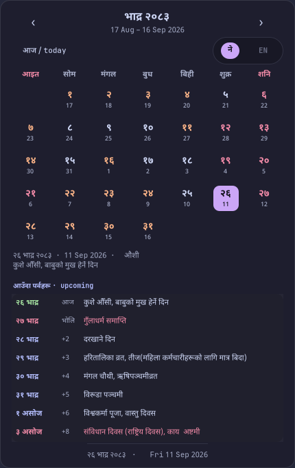
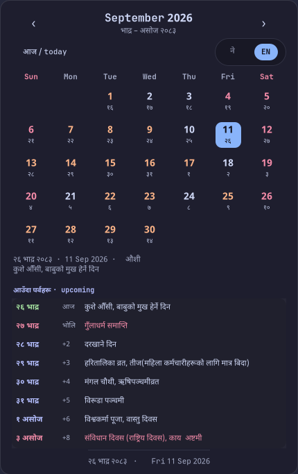

<div align="center">

# नेपाली पात्रो

### nepali-patro

**Bikram Sambat and Gregorian, in one popup, with the next Nepali festivals underneath.**

Click your bar clock. Click it again and it's gone.

<br>


<sub>Real keystrokes, real render: `n` steps a day, `l`/`h` move months, `m` flips calendar, `t` returns to today.</sub>

<br>

<a href="#install"></a>
<a href="#install"></a>
<a href="#install"></a>
<a href="#install"></a>
<a href="#fast-and-measured"></a>
<a href="#fast-and-measured"></a>
<a href="#checked-not-assumed"></a>
<a href="LICENSE"></a>

</div>

---

Nepal runs on Bikram Sambat, your laptop runs on Gregorian, and every festival
date lives in the gap between the two. This puts both grids in one place, tells
you what `भोलि` holds, and never sends you to a browser to find out when Dashain
starts.

<table>
<tr>
<td width="50%"></td>
<td width="50%"></td>
</tr>
<tr>
<td align="center"><b>Nepali mode</b> — BS grid, Gregorian numerals below, mauve accent</td>
<td align="center"><b>English mode</b> — Gregorian grid, BS numerals below, blue accent</td>
</tr>
</table>

## What you get

**Both calendars, either way round.** Nepali mode draws the BS month with
Gregorian day numbers underneath; English mode flips it. The weekday header
changes script with it.

**Upcoming festivals in the same window.** Eight scrollable rows of what is
next, counted in `आज` / `भोलि` / `+N`. Click one and the grid jumps to that day.

**Colour that carries meaning.** Red is a day off, weekend or holiday. Peach
means something is happening but you are still working. The filled pill is
today, tinted to match whichever calendar you are reading.

**Tithi and event names** in the detail line, and in every day's tooltip.

**Keyboard first.** `h`/`l` for months, `n`/`p` for days, `t` for today, `m` to
flip calendars, `q` to dismiss.

**Offline by default.** Date conversion is entirely local and needs no network,
ever. Festival data caches to disk on first fetch, and nothing blocks on the
wire: the grid paints instantly, events fill in behind it.

**Works with or without layer-shell.** On a `wlr-layer-shell` compositor it is a
true bar popup, anchored under waybar and toggled by the same click. On X11, or
on GNOME which will not implement the protocol, the same window opens as an
ordinary one and closes when it loses focus.

**No pip packages.** Standard library plus system GTK, which is exactly why the
version before this one died when Python 3.14 landed.

## Install

Two things must exist before it will run: **GTK 4** and **PyGObject**. Everything
else is standard library. `gtk4-layer-shell` is optional and only does anything
on Wayland.

<table>
<tr><th align="left">Distro</th><th align="left">Get the dependencies</th></tr>
<tr><td>Arch</td><td><code>sudo pacman -S --needed gtk4 python-gobject gtk4-layer-shell noto-fonts libnotify</code></td></tr>
<tr><td>Fedora</td><td><code>sudo dnf install gtk4 python3-gobject gtk4-layer-shell google-noto-sans-devanagari-fonts libnotify</code></td></tr>
<tr><td>Debian / Ubuntu</td><td><code>sudo apt install libgtk-4-1 python3-gi gir1.2-gtk4layershell-1.0 fonts-noto-devanagari libnotify-bin</code></td></tr>
</table>

Then:

```bash
git clone https://github.com/incogcyberpunk/nepali-patro.git ~/nepaliPatro
~/nepaliPatro/patro --check    # prove the dates are right
~/nepaliPatro/patro            # open it
```

**Linux only, deliberately.** The launcher is a shell script, notifications go
through `notify-send`, paths follow the XDG base directory spec, the desktop
entry is a freedesktop one, and the anchored-popup behaviour this exists for is a
Wayland protocol. macOS and Windows are out of scope.

**What layer-shell buys you.** Under Hyprland, sway, river or niri the popup
anchors to the top edge, holds keyboard focus, and dismisses on a click anywhere
outside. Without it you get a normal small window your window manager places,
which closes when you click away from it. Both are dismissed by `q` or `Escape`.

<details>
<summary><b>Wire it to waybar, Hyprland and your shell</b></summary>

<br>

Clock module in `~/.config/waybar/modules.json`:

```json
"clock": {
    "format": "{:%H:%M}",
    "tooltip": false,
    "on-click": "~/nepaliPatro/patro",
    "on-click-right": "~/nepaliPatro/patro --notify"
}
```

`"tooltip": false` matters, or waybar's own hover tooltip floats over the popup.

Today's date as a login notification, in `~/.config/hypr/conf/autostart.lua`:

```lua
hl.exec_cmd("~/nepaliPatro/patro --notify")
```

A keybind, in `~/.config/hypr/conf/keybindings/appKeybinds.lua`:

```lua
hl.bind("SUPER + C", hl.dsp.exec_cmd("~/nepaliPatro/patro"))
```

Shell aliases:

```bash
alias nepdate='~/nepaliPatro/patro --today'
alias patro='~/nepaliPatro/patro'
```

App launcher entry. `Exec=` takes neither `~` nor variables, so the shipped
`.desktop` carries a `@PATRO@` placeholder that you substitute once:

```bash
sed "s|@PATRO@|$HOME/nepaliPatro/patro|g" ~/nepaliPatro/nepaliPatro.desktop \
    > ~/.local/share/applications/nepaliPatro.desktop
```

</details>

## Use it

| Key | | Key | |
|---|---|---|---|
| `q` `Esc` | close | `n` | next day |
| `h` `←` | previous month | `p` | previous day |
| `l` `→` | next month | `t` `Home` | back to today |
| `m` | switch calendar | `Tab` | walk the controls |

Click a day to pin the detail line to it, click it again to release. Click an
event row to jump there. Click anywhere outside to dismiss.

## Also a date tool

```console
$ patro --today
२६ भाद्र २०८३  ·  Fri 11 Sep 2026

$ patro --upcoming 4
           २६ भाद्र २०८३    आज  कुशे औँसी, बाबुको मुख हेर्ने दिन
*          २७ भाद्र २०८३    1d  गुँलाधर्म समाप्ति
           २८ भाद्र २०८३    2d  दरखाने दिन
           २९ भाद्र २०८३    3d  हरितालिका व्रत, तीज(महिला कर्मचारीहरूको लागि मात्र बिदा)

$ patro --notify
```

`*` marks a holiday. Append `--offline` to any of them to stay off the network.
`--notify` goes through `notify-send`; without `libnotify` installed it prints the
same text instead of losing it.

## Fast, and measured

| | |
|---|---|
| Cold open, process start to first frame | **~350 ms** |
| Toggling an open popup shut | **8 ms** |
| Resident memory while open | 90 MB |

Three changes got it there, each one profiled rather than guessed. Lazy imports
in `data.py` took `import data` from 92 ms to 28 ms, because the paint path has
no use for `urllib`, `argparse`, `subprocess` or `tempfile`. GTK's **cairo**
renderer beat both GPU renderers — 347 ms against 441 for `gl` and 521 for
`vulkan` — since a small, short-lived surface is all first-frame latency, and
building a GL context costs more than hardware drawing saves. And a `gdbus` fast
path means closing no longer starts a second interpreter just to deliver one
message.

The full profile, including why a C rewrite would only buy back ~90 ms and where
the remaining 55 ms of `asyncio` comes from, is in
[docs/REFERENCE.md §11](docs/REFERENCE.md#11-performance).

## Checked, not assumed

```console
$ patro --check
nepaliPatro selfcheck
  table: 126 years, BS 1975-2100
  anchor: 2000-01-01 BS = 1943-04-14 AD, verified against 2082 new year
  round trip: 46022 consecutive days AD->BS->AD
  grid: leading columns and month lengths consistent for 4 sample years
  range guard: rejects years outside the table and impossible days
    skipping BS 2073: 370 day entries in a 365/366 day year
    skipping BS 2081: Jestha/Ashar boundary contradicts two other sources
  dataset cross-check: 3287 ad/bs pairs across 9 years agree exactly
  events: current month 31 days, upcoming() returned 5 (offline)
  day step: n/p cross month boundaries both ways and stop at the table edge
  notify: a missing notify-send returns False instead of raising
  no display: exits 1 with a message instead of a traceback
ok — today is २७ भाद्र २०८३ / 2026-09-12
```

Every day in the vendored month table round-trips, and 3,287 independently
published `ad`/`bs` pairs agree with it exactly. Two dataset years are
quarantined with stated reasons: one contradicts itself, one contradicts two
other sources.

## Honest limits

- Date conversion runs out on **12 April 2044**, the end of BS 2100. Month
  lengths are published per year, not computed, so the table has an end — and
  past it the code raises rather than guessing.
- Festival data currently ends at **BS 2083**, around April 2027. Both upstreams
  stop there and publish yearly. When it runs out the calendar keeps working and
  the events pane simply goes quiet.
- Without layer-shell there is no anchoring: your window manager decides where
  the window lands, and it keeps its titlebar.
- Weekend red and holiday red are the same red.
- The invisible click-catcher swallows the first click you make elsewhere.
- Every open is a fresh process, hence the 350 ms.

## How it fits together

`patro` dispatches, `app.py` draws, `data.py` converts and fetches,
`selfcheck.py` proves it, `style.css` themes it.

Under layer-shell: two surfaces — the calendar and a transparent fullscreen
click catcher — and one D-Bus name carrying the toggle. Without it: one ordinary
window that watches its own focus. Events cached in `~/.cache/nepaliPatro`, and
your chosen calendar remembered in `~/.config/nepaliPatro/state`.

**[Full reference documentation](docs/REFERENCE.md)** covers the conversion
algorithm and its anchor date, the event schema and cache policy, every CSS
class, the GTK traps behind several non-obvious lines, the performance data,
troubleshooting, extension points, and the design decisions with the
alternatives that were rejected.

## License

[GNU General Public License v3.0](LICENSE).

## Credits

Month-length table from [amitgaru/nepali-datetime](https://github.com/amitgaru/nepali-datetime)
(Apache-2.0). Festival data from [S4NKALP/nepali-calendar-api](https://github.com/S4NKALP/nepali-calendar-api)
(MIT), with [sajanm/nepali-lunar-calendar-events](https://github.com/sajanm/nepali-lunar-calendar-events)
as fallback and as the oracle that validates the table. Colours are
[Catppuccin](https://github.com/catppuccin/catppuccin) Mocha. Event data is
fetched and cached at runtime, never redistributed here.
